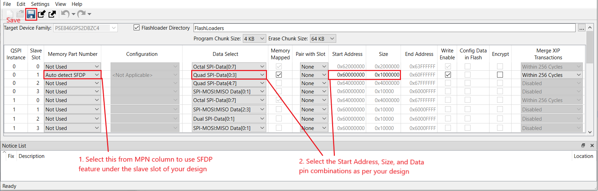

[Click here](../README.md) to view the README.

## Design and implementation

This example uses the QSPI hardware block for interfacing with the external memory through four data lines and one slave select line. This example writes 64 bytes of data to the external memory in Quad SPI mode. The written data is read back to check its integrity. The UART resource outputs the debug information to a terminal window. User LED 1 indicates the status of the read and write operation.

**Table 1. Application projects**

Project | Description
--------|------------------------
*proj_cm33_s* | Project for CM33 secure processing environment (SPE)
*proj_cm33_ns* | Project for CM33 non-secure processing environment (NSPE)
*proj_cm55* | CM55 project

 

This example uses the [serial-memory](https://github.com/Infineon/serial-memory) library along with the memory configuration generated using the QSPI Configurator tool, which can be accessed from the **Quick Panel** in Eclipse IDE for ModusToolbox&trade;. This tool generates the configuration files *cycfg_qspi_memslot.c/.h* under the *bsps/<BSP>/config/GeneratedSource* directory based on the memory part selected.

By default, the example comes with a fixed configuration of the **Memory Part Number** used in BSP. But this example also works with the SFDP standard to auto-discover all the flash parameters and the commands for read/program/erase operations. The PDL(Peripheral Driver Library) files *cy_smif_memslot.c/.h* implements this SFDP feature.

To use the SFDP feature, modify the *design.cyqspi* file located under *bsps/<BSP>/config/* as per the following:

1. Open the *design.cyqspi* file located under *bsps/<BSP>/config/* using the QSPI Configurator tool

2. Select **Auto detect SFDP** under the **Memory Part Number** field in your slave slot of your design and click **Save** as shown in the following figure to save the file

   **Figure 1. QSPI Configurator tool to configure SFDP**

   
